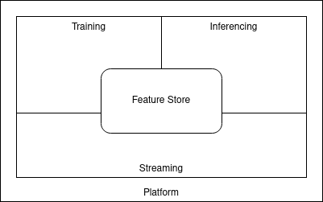

# 1. Realtime-MLOps: A framework of open-source technologies to design real-time ml systems.

Realtime MLOps provides a cloud-native approach to design machine learning systems enabling the use of real-time.
This setup enables and demonstrates real-time feature engineering, online inferencing, real-time monitoring and continual learning as a a matured Kubernetes-native MLOps platform. 

- [1. Realtime-MLOps: A framework of open-source technologies to design real-time ml systems.](#1-realtime-mlops-a-framework-of-open-source-technologies-to-design-real-time-ml-systems)
- [2. Summary](#2-summary)
- [3. Quickstart](#3-quickstart)
- [4. Access](#4-access)
- [5. Demonstration](#5-demonstration)
  - [5.1. Real-time Feature Engineering](#51-real-time-feature-engineering)
  - [5.2. Online Inferencing](#52-online-inferencing)
  - [5.3. Continual Learning](#53-continual-learning)
  - [5.4. Real-time Monitoring](#54-real-time-monitoring)

# 2. Summary

The platform is divided into five modules to enable different aspects of a real-time mlops system. 



1. Kubernetes is used in conjunction with Github to provide an Infrastructure-as-Code enabled way of managing the platform.
2. Strimzi Kafka Operator and KNative Eventing are used to provide and abstract streaming capabilities in a Kubernetes-native way. Stream Processing is accomplished by using Bytewax Dataflows for variuous use-cases.
3. Feast is used to create a feature store to centralize features and provide access to real-time and historical features. Feast is used to implement a redis online store and a postgresql offline store.
4. To orchestrate modular ml pipelines tekton is used alongside with mlflow to store experiment metadata and model artifacts. Tekton enables reusable event triggered pipeline runs.
5. Inferencing is done by using KServe and Prometheus to allow model serving, model updating and model monitoring. 

# 3. Quickstart
Download the repistory and create conda environment
`make env`
and activate
`conda activate realtime-mlops`

Simply use `make install` to install all components and run the demonstration examples.

# 4. Access
Telepresence provides a convinient way to access internal Kubernetes services externally. 

Web interfaces then are available at:
- prometheus: http://prometheus.prometheus.svc.cluster.local/
- tekton: http://tekton-dashboard.tekton-pipelines.svc.cluster.local:9097
- mlflow: http://mlflow.mlflow.svc.cluster.local/
- minio: http://mlflow-minio.mlflow.svc.cluster.local:9000/
- demo-app: http://webapp.default.svc.cluster.local/

If the setup did run successfully but the web UIs are not available it may help to quit and connect telepresence client again.
```
telepresence quit
telepresence connect
```

# 5. Demonstration
Check out the demonstraion for a real-time ml use-case.

## 5.1. Real-time Feature Engineering
see demonstration/realtime-feature-engineering/README.md

## 5.2. Online Inferencing
see demonstration/online-inferencing/README.md

## 5.3. Continual Learning
see demonstration/continual-learning/README.md

## 5.4. Real-time Monitoring
see demonstration/realtime-monitoring/README.md