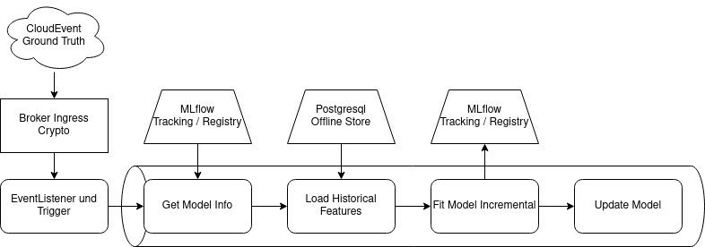
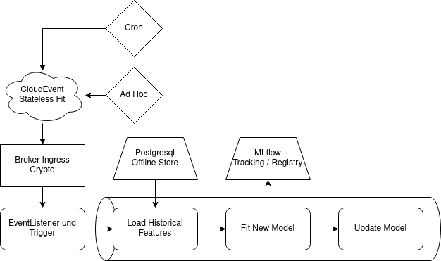

# Continual Learning

The usage of Continual Learning allows models in a machine learning system to adapt quickly to new or changing data in a dynamic environment. It is implemented in the form of incremental training pipelines that use a Stateful Training approach to use new Data to modify an existing models weights. However this might lead to Catastrophic Forgetting where a model unlearns old knowledge in favor of the new knowledge. This leads to a requirement of being able to periodically perform a training from scratch using Stateless Training.
[Real-time machine learning: challenges and solutions](https://huyenchip.com/2022/01/02/real-time-machine-learning-challenges-and-solutions.html#towards-continual-learning) is a great read about the topic of Continual Learning. Here we leverage Tekton to build reusable Pipelines which then are triggered in an event based manner.

## Stateful Training

With a Stateful Training an existing model is trained incrementally with the new data. Here the events of new data are reused to trigger the pipeline for Stateful Training.

Using the Knative Broker Ingress the events are forwarded to the Tekton EventListener to trigger a PipelineRun. The first tasks then loads the model and the parameters initially used for training from MLflow Model Registry and MLflow Tracking. Then the Feature Store is queried to retrieve the new data. Afterwards the model is fit incrementally and saved to MLflow including alongside its training parameters. Finally the model is updated with Kubernetes and KServe.

## Stateless Training

With a Stateless Training a new model is created with a subset of the available data. With Continual Learning a Stateless Training can be used to overcome Catastrophic Forgetting.

In the demonstration a Kubernetes CronJob is used to trigger the pipeline. It is also possible to trigger Stateless Training ad hoc using the webapp. Again, Broker Ingress is used to forward CloudEvents to a Tekton EventListener which triggers a PipelineRun. The pipeline then retrieves historical values by querieing the offline store. Then a new model is created using XGBoost and a grid search cv to optimize parameters. The model is uploaded to the MLflow Model Registry and parameters are saved using MLflow Tracking. Afterwards the model is updated using Kubernetes and KServe. 