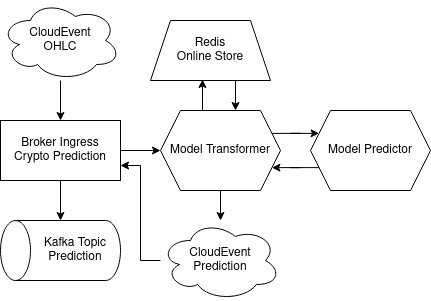

# Online Inferencing

With Online Inferencing real-time features are used alongside with streaming data to leverage a models capabibilities in a machine learning system in real-time. Upon request the model is able to query to feature store's online store to retrieve real-time features with a low latency.

With KServe it is possible to deploy machine learning models in a serverless manner. The deployed model server is providing the model capabilities in the system by providing REST/gRPC APIs. Here a Knative Trigger is used to forward the incoming event on the Broker Ingress to the deployed model server. KServe allows to do various tasks with incoming data by utilizing a transformer component before sending the request to the predictor. The transformer is used to query the online store to retrieve features with a low latency and join the data. The request is then sent to the predictor for inferencing. Afterwards the response is sent to the transformer for a postprocessing. Because inferencing is done asynchronously, the transformer logs the response as a CloudEvents using the Broker Ingress.