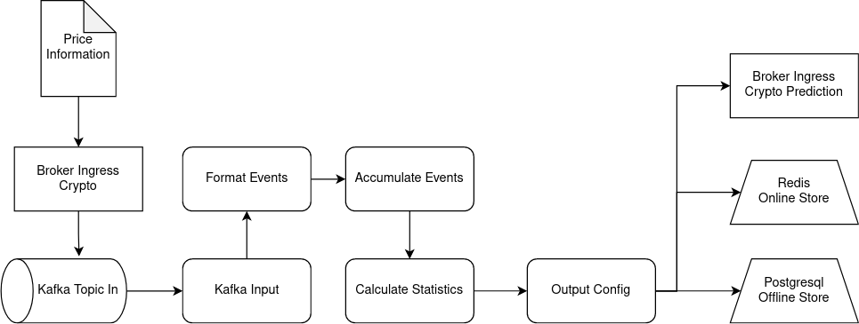

# Real-time Feature Engineering

With real-time feature engineering streaming data is used to calculate real-time features. Dataflow enables an unified approach for batch and streaming. Here a Dataflow is used to do feature engineering on streaming data and transporting those features to various destinations like the online store of a feature store. 

To do feature engineering there needs to be some kind of data in the system. With the use of a simple python webservice data is crawled every minute and fed into the system by using the Broker Ingress. The Broker provisions a kafka topic which is used as the data source of a Dataflow. The Dataflow reacts on new incoming data in realtime by guiding the data alongside a directed graph. There the data gets formatted and accumulated into windows. Then statistics are calculated for every window. Those statstics are transported to outputs like the online and offline store of the feature store aswell as a Broker Ingress.