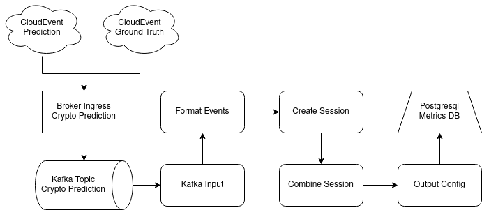

# Real-time Monitoring

While Kserve enables basic devops monitoring by using prometheus metrics the monitoring of data and model metrics is different for every application. Therefore they have to be monitored in individual feadback loops. With Kserver the logging component can be used to log incoming and outgoing data to an endpoint. If used in conjunction with a Broker Ingress those logs can be sent to a Kafka topic.

Here the Broker Ingress is used so that the model predictions and the ground truth label are created in the same kafka topic. This way the feedback loop can be realised by creating a Dataflow to read data from that topic. With the Dataflow the data is formatted and combined into sessions so that prediction and ground truth label belong to the same session. Then the both information are corellated and written into a metrics databse for further analysis.